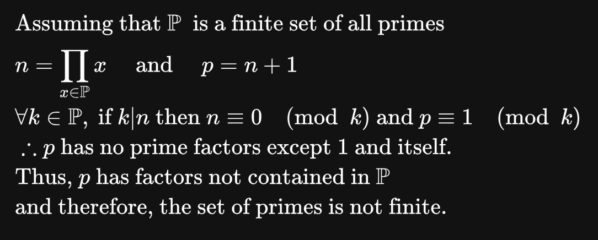

### Hi 

feel free to look around here, or take a look at my website [dfsu.systems](http://dfsu.systems)

take a look at [styxcon](https://styxcon.com), our awesome dev team

note: there is a logical error, sincep is not necessarily a new prime.
The correct statement is that p has to only contain prime factors not in z. 
will be fixed shortly(™)
